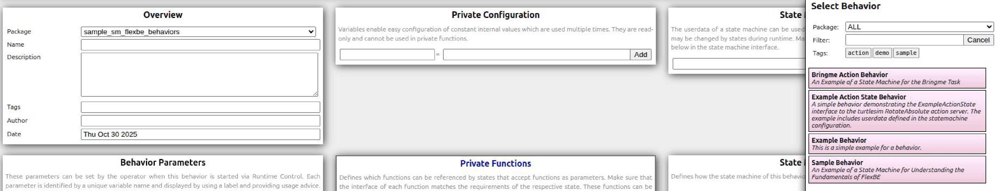

# Chapter 7 Planning
## Overview

This page provides sample programs and supplementary information for Chapter 7.

## Installation Guide

This section explains the procedure to install this repository.

### Environment Setup for `Smach` and `FlexBE`

1. Install the required ROS-related packages.
  ```console
  $ sudo apt-get update
  $ sudo apt-get install -y ros-humble-smach ros-humble-executive-smach
  ```

3. If you are using `FlexBE` for the first time, download `FlexBE Behavior Engine` and `FlexBE WebUI`.
  ```console
  $ cd ~/airobot_ws/src/
  $ git clone -b 4.0.0 https://github.com/FlexBE/flexbe_behavior_engine.git
  $ git clone https://github.com/AI-Robot-Book-Humble/flexbe_webui.git
  ```

4. Build the downloaded repositories.
  ```console
  $ cd ~/airobot_ws/
  $ rosdep update
  $ rosdep install --from-paths src --ignore-src
  $ colcon build
  $ source install/setup.bash
  ```

5. Finally, install the dependent packages for FlexBE WebUI using the following command.
  ```console
   $ cd ~/airobot_ws/src/flexbe_webui/
   $ pip3 install -r requires.txt
  ```


### Setting up this repository

1. Download this repository.
  ```console
  $ cd ~/airobot_ws/src/
  $ git clone https://github.com/AI-Robot-Book-En/chapter7.git
  ```
> [!IMPORTANT]
> To use the Action files provided in [airobot_interfaces](https://github.com/AI-Robot-Book-En/chapter2/tree/master/airobot_interfaces) under [chapter2](https://github.com/AI-Robot-Book-En/chapter2), please clone that repository as well if it has not already been installed.

2. Build the downloaded repository.
  ```console
  $ cd ~/airobot_ws/
  $ colcon build
  $ source install/setup.bash
  ```


## How to Create a State Machine

1. Set the workspace PATH.
  ``` console
  $ echo "export WORKSPACE_ROOT=~/airobot_ws" >> ~/.bashrc
  $ source ~/.bashrc
  ```

2. Move to the `src` folder in the workspace.
  ``` console
  $ cd ~/airobot_ws/src/
  ```

3. Create a package for Behaviors.
  ``` console
  $ ros2 run flexbe_widget create_repo hello_world
  ```
> [!NOTE]
> The name `hello_world` can be replaced with any repository name you wish to create.

4. Answer "**no**" to the following prompt.
  ```console
  Initializing new flexbe project repo hello_world_behaviors ...

  (2/5) Fetching project structure...
  Cloning into 'hello_world_behaviors'...
  remote: Enumerating objects: 166, done.
  remote: Counting objects: 100% (166/166), done.
  remote: Compressing objects: 100% (89/89), done.
  remote: Total 166 (delta 68), reused 157 (delta 59), pack-reused 0 (from 0)
  Receiving objects: 100% (166/166), 33.55 KiB | 434.00 KiB/s, done.
  Resolving deltas: 100% (68/68), done.
  Set up for ROS 2 development ...
  Already on 'ros2-devel'
  Your branch is up to date with 'origin/ros2-devel'.

  (3/5) Configuring project template...

  (4/5) Removing the original git repository...
  (5/5) Do you want to initialize a new Git repository for this project? (yes/no) no
  ```

4. Compile the created package.
  ``` console
  $ cd ~/airobot_ws/
  $ colcon build
  $ source install/setup.bash
  ```

5. Launch `FlexBE WebUI`.
  ``` console
  $ ros2 launch flexbe_webui flexbe_full.launch.py
  ```

> [!NOTE]
> If `FlexBe WebUI` does not start, required dependencies may not be installed.
In that case, run `pip3 install -r requires.txt` inside the `flexbe_webui` directory.

6. The `Behavior Dashboard` will be displayed.


7. Click `Load Behavior` to display the list of available behaviors on the right side.


8. Select the behavior named `Example Behavior`.


9. Move to the `Statemachine Editor` and inspect the state machine.


10. Move to `Runtime Control` and execute the state machine.
First, set the initial value for the waiting time parameter called `Waiting Time`.


11. Click `Start Execution` to begin execution.

| Print State | Wait State |
| --- | --- |
|  |  |

> [!NOTE]
> To transition from the `Print State` to the `Wait State`, change Autonomy from Low to Full.

12. Example output from the execution terminal.
  ```console
  [3:52:27 PM] Onboard engine is ready.
  [3:52:27 PM] --> Preparing new behavior...
  [3:52:27 PM] Executing mirror ...
  [3:52:27 PM] Onboard Behavior Engine starting [Example Behavior : 1094639919]
  [3:52:28 PM] Hello World!
  [3:52:37 PM] PreemptableStateMachine 'Example Behavior' spin() - done with outcome=finished
  [3:52:37 PM] No behavior active.
  [3:52:37 PM] --- Behavior Mirror ready! ---
  [3:52:37 PM] Onboard engine is ready.
  ```


## Directory Structure

- **[sample_sm_flexbe](sample_sm_flexbe):** Sample program of a two-state state machine (FlexBE version)
- **[bringme_sm_flexbe](bringme_sm_flexbe):** Sample program of a Bring-me task state machine (FlexBE version)
- **[pseudo_node_action](pseudo_node_action):** Sample pseudo-node programs for speech, navigation, vision, and manipulation in the Bring-me task (Action version)
- **[(Archive) sample_sm_smach](sample_sm_smach):** Sample program of a two-state state machine (Smach version)
- **[(Archive) bringme_sm_smach](bringme_sm_smach):** Sample program of a Bring-me task state machine (Smach version)
- **[(Archive) pseudo_node_service](pseudo_node_service):** Sample pseudo-node programs for speech, navigation, vision, and manipulation in the Bring-me task (Service version)
