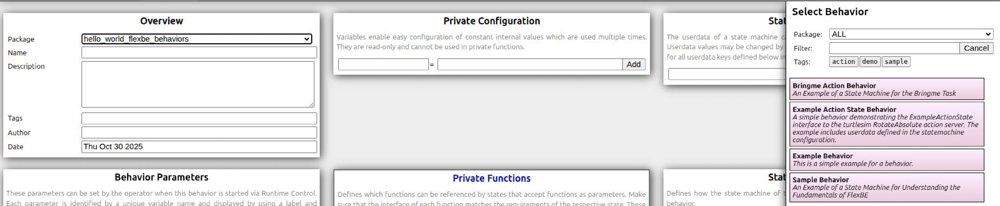
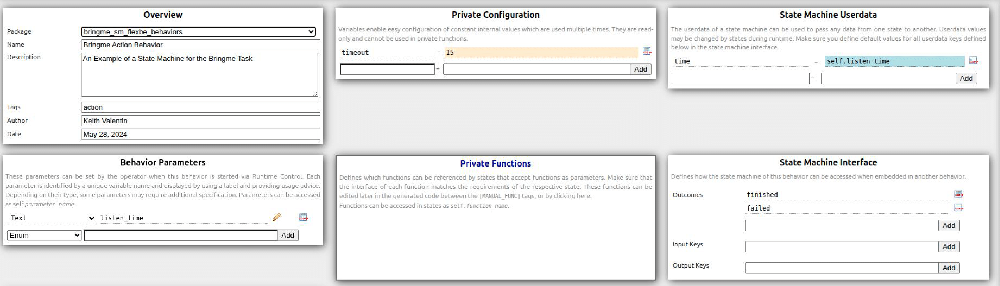

# bringme_sm_flexbe

Sample programs from Section 7.4
This repository provides a FlexBE-based state machine implementation for the Bring me task.


## Execution

1. To run the required Action servers for the Bring-me task, launch the file [bringme_nodes.launch.py](../pseudo_node_action/launch/bringme_nodes.launch.py).
  ```console
  $ ros2 launch pseudo_node_action bringme.launch.py
  ```

2. Launch the `FlexBE WebUI`.
  ```console
  $ ros2 launch flexbe_webui flexbe_full.launch.py

> [!NOTE]
> If the `FlexBe WebUI` does not start, some dependent packages may not be installed.
In that case, run `pip3 install -r requires.txt` inside the `flexbe_webui` directory.
  ```

3. The `Behavior Dashboard` will be displayed.


4. Click `Load Behavior` to display the list of available behaviors on the right-hand side.


5. From the list, select the behavior named `Bringme Action Behavior`.


6. Move to the `Statemachine Editor` and inspect the structure of the state machine.


7. Move to `Runtime Control` to execute the state machine.
First, set the value of `listen_time`.

> [!NOTE]
> `listen_time`represents the activation duration of speech recognition.
This value can be freely adjusted.


7. Next, click `Start Execution` to begin execution.

| Voice State | Navigation State |
| --- | --- |
|  |  |

| Vision State | Manipulation State |
| --- | --- |
|  |  |

8. Example output from the execution terminal:
  ```console
  [00:37:59] Onboard engine is ready.
  [00:38:00] --> Mirror - received updated structure with checksum id = 741633216
  [00:38:00] Activate mirror for behavior id = 741633216 ...
  [00:38:00] --> Preparing new behavior...
  [00:38:00] Executing mirror ...
  [00:38:00] Onboard Behavior Engine starting [Bringme Action Behavior : 741633216]
  [00:38:11] Speech recognition result: bring me a cup from the kitchen
  [00:38:15] Navigation failed
  [00:38:18] Navigation failed
  [00:38:28] Navigation result: reached
  [00:38:38] Object recognition result: found
  [00:38:39] Object grasping failed
  [00:38:49] Object recognition result: found
  [00:38:59] Object grasping result: reached
  [00:38:59] PreemptableStateMachine 'Bringme Action Behavior' spin() - done with outcome=finished
  [00:39:00] No behavior active.
  [00:39:00] Onboard engine is ready.
  [00:39:00] --- Behavior Mirror ready! ---
  [00:39:10] Onboard engine is ready.
  ```


## List of States

* [voice_action_state.py](bringme_sm_flexbe_states/bringme_sm_flexbe_states/voice_action_state.py):
  * Implementation of the speech recognition state

* [navigation_action_state.py](bringme_sm_flexbe_states/bringme_sm_flexbe_states/navigation_action_state.py):
  * Implementation of the navigation state

* [vision_action_state.py](bringme_sm_flexbe_states/bringme_sm_flexbe_states/vision_action_state.py):
  * Implementation of the object recognition state

* [manipulation_action_state.py](bringme_sm_flexbe_states/bringme_sm_flexbe_states/manipulation_action_state.py):
  * Implementation of the object grasping state

## List of Behaviors

* [bringme_action_behavior_sm.py](bringme_sm_flexbe_behaviors/bringme_sm_flexbe_behaviors/bringme_action_behavior_sm.py):
  * State machine for the Bring me task, including speech recognition, navigation, object recognition, and object grasping states


## Help

## Authors

HAGIWARA Yoshinobu


## History


## License

Copyright (c) 2025, HAGIWARA Yoshinobu, VALENTIN CARDENAS Keith and SIM Jiahao.  
All rights reserved.  
This project is licensed under the Apache License 2.0 license found in the LICENSE file in the root directory of this project.

## References
